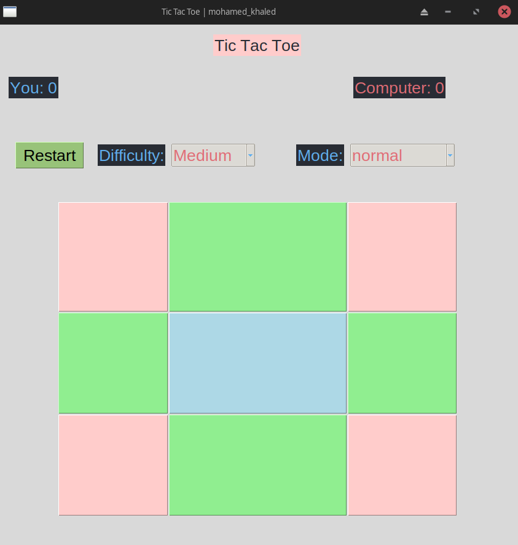
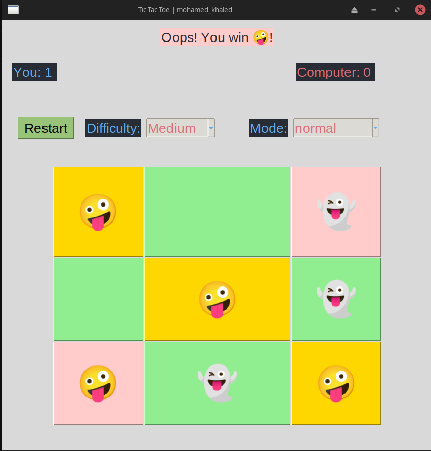
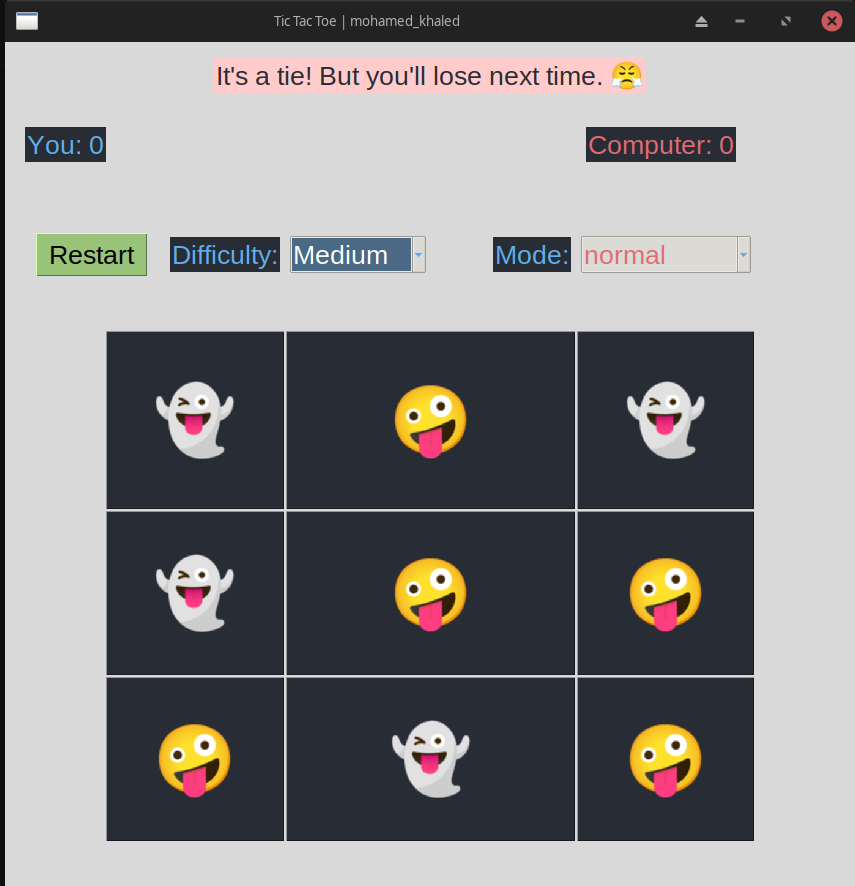
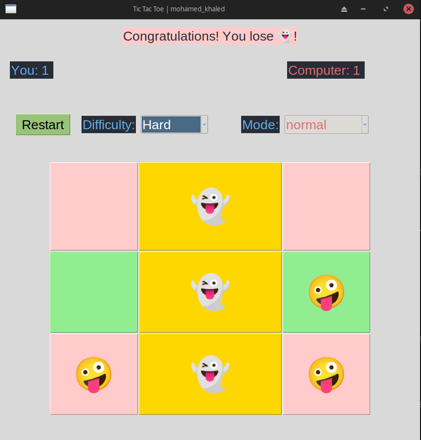
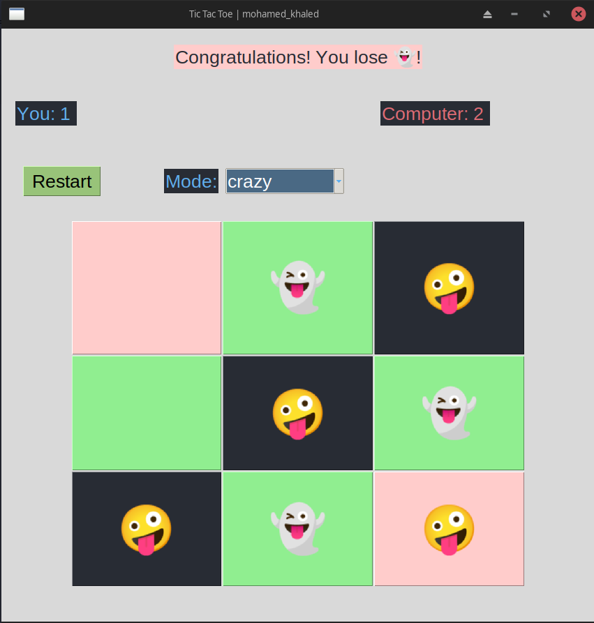
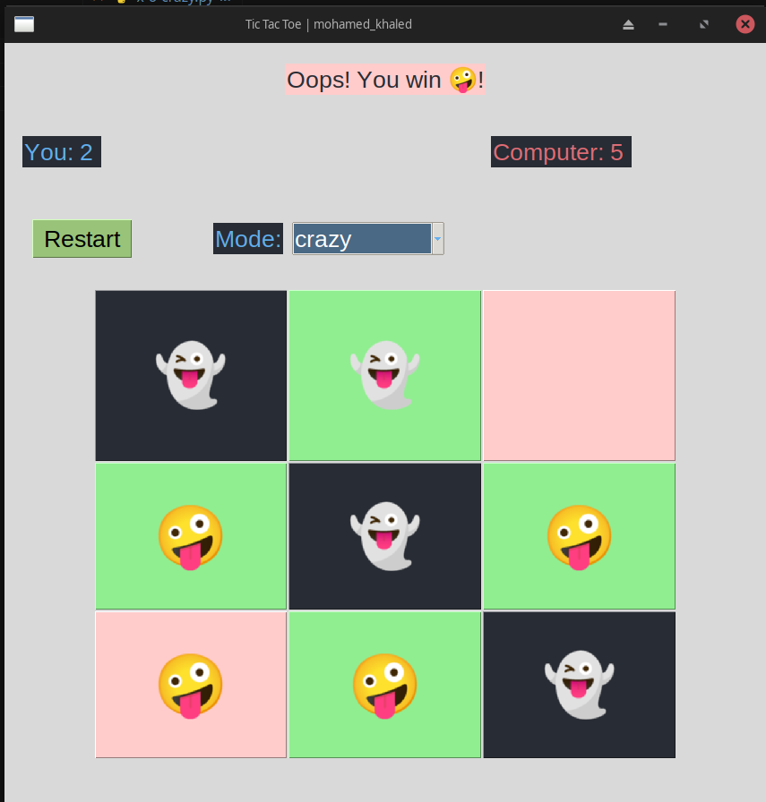

# # X-O Game Project

## Overview

This project is an enhanced version of the classic X-O (Tic-Tac-Toe) game. It was initially developed as a school assignment, but I decided to take it a step further by adding additional features to make the game more challenging and enjoyable.

## Features

- **Difficulty Levels:** Choose between different difficulty levels (Easy, Medium, Hard) to match your skill level.
- **AI Intelligence:** Select the computer's intelligence level to play against a more challenging opponent.
- **Crazy Mode:** A unique twist to the traditional game where the objective is to make your opponent win. If you win, you lose!

## Installation

To get started with this project, follow these steps:

1. Clone the repository:
    ```bash
    git clone https://github.com/your-username/x-o-game.git
    ```
2. Navigate to the project directory:
    ```bash
    cd x-o-game
    ```
3. Open the project in your preferred IDE or text editor.

## Usage

1. Run the `main.py` file to start the game.
    ```bash
    python main.py
    ```
2. Choose your desired difficulty level and AI intelligence.
3. For an extra challenge, try out the Crazy Mode!

## Contributing

Contributions are welcome! If you have suggestions for improvements or new features, feel free to open an issue or submit a pull request.

## License

This project is licensed under the MIT License. See the [LICENSE](LICENSE) file for details.

## Acknowledgements

Thanks to [@Almdrasa](https://github.com/Almdrasa) and my mentor [@Ahmad Fathy](https://github.com/afkhalid) for their support and guidance in this project.

---

### Screenshots








---

Happy gaming! If you have any questions or feedback, please don't hesitate to reach out.


